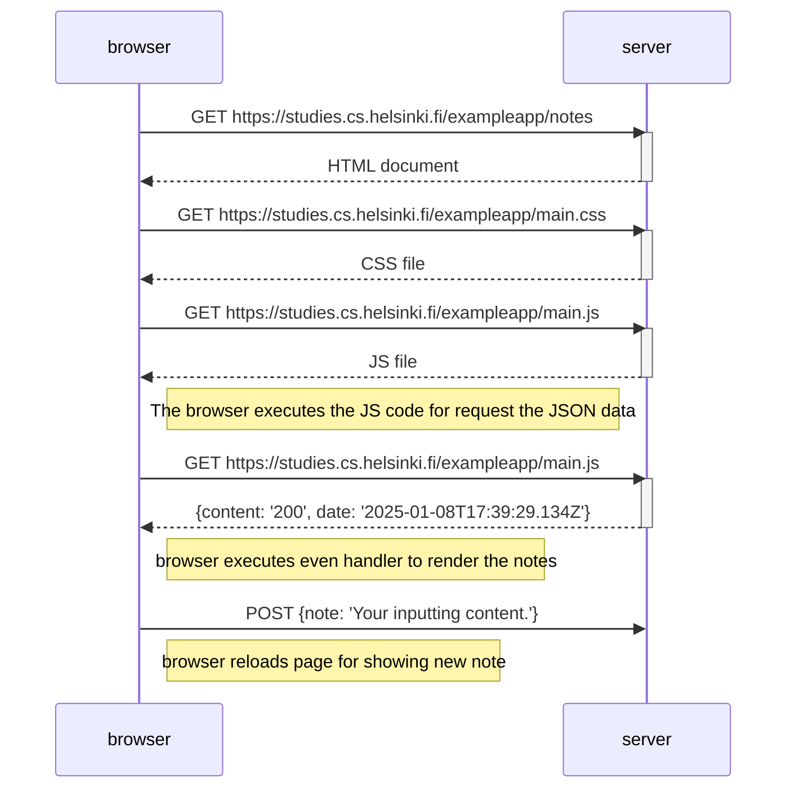

```mermaid
sequenceDiagram
    participant browser
    participant server


    browser->>server: GET https://studies.cs.helsinki.fi/exampleapp/notes
    activate server
    server-->>browser: HTML document
    deactivate server

    browser->>server: GET https://studies.cs.helsinki.fi/exampleapp/main.css
    activate server
    server-->>browser: CSS file
    deactivate server

    browser->>server: GET https://studies.cs.helsinki.fi/exampleapp/main.js
    activate server
    server-->>browser: JS file
    deactivate server

    Note right of browser: The browser executes the JS code for request the JSON data

    browser->>server: GET https://studies.cs.helsinki.fi/exampleapp/main.js
    activate server
    server-->>browser: {content: '200', date: '2025-01-08T17:39:29.134Z'}
    deactivate server

    Note right of browser: browser executes even handler to render the notes

    browser->>server: POST {note: 'Your inputting content.'}
    activate server

    Note right of browser: browser reloads page for showing new note

```